# GreatSQL MCP Server

## 简介

**GreatSQL MCP Server**是GreatSQL社区推出的智能数据库操作中间件。其核心价值在于：

1. 自然语言转SQL（Text2SQL）

- 用户只需输入“查询学生表中男生数量”，系统自动生成并执行`SELECT COUNT(*) FROM student WHERE gender='男'`。

2. 零代码数据库管理

- 提供数据库/表信息查看、数据增删改查等全功能，无需编写任何SQL语句。

3. 无缝集成LLM生态

- 通过标准化API接入Chatbox等AI工具，构建“对话即操作”的全新体验。

## GreatSQL + MCP + LLM 架构

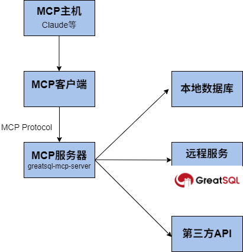

## 环境准备

### 1、准备GreatSQL数据库

可以用Docker方式快速创建一个GreatSQL数据库服务，参考文档[**使用Docker安装GreatSQL**](https://greatsql.cn/docs/8.0.32-27/3-quick-start/3-3-quick-start-with-docker.html)，命令如下：

拉取和启动容器：
```bash
$ docker pull registry.cn-beijing.aliyuncs.com/greatsql/greatsql

$ docker run -d --name=greatsql --hostname=greatsql \
 -e MYSQL_ROOT_PASSWORD="MCP-Server@GreatSQL" \
 -e MYSQL_ROOT_HOST:"%" \
 -p 3306:3306 \
 greatsql/greatsql
```

容器初始化需要一点时间，运行 `docker logs greatsql` 查看进度，当看到`Ready for start up.`就表示GreatSQL数据库容器服务已就绪并正常运行。

在宿主机上登录数据库，验证数据库的连通性。

```bash
$ mysql -h127.0.0.1 -uroot -P3306 -p"MCP-Server@GreatSQL" -e "SELECT VERSION();"
mysql: [Warning] Using a password on the command line interface can be insecure.
+-----------+
| VERSION() |
+-----------+
| 8.0.32-27 |
+-----------+
```

连接GreatSQL服务器，新建 *mcp* 数据库，并创建MCP服务专用账户以及授予相应的权限

```sql
greatsql> CREATE DATABASE mcp;
greatsql> CREATE USER mcp IDENTIFIED WITH mysql_native_password by 'MCP-Server@GreatSQL';
greatsql> GRANT SELECT ON *.* TO mcp;
greatsql> GRANT PROCESSLIST ON *.* TO mcp;
greatsql> GRANT ALL ON mcp.* TO mcp;
```

> 这里注意创建 mcp 账户时要指定 *mysql_native_password*，因为还不支持默认的 *caching_sha2_password*。

### 2、准备Java环境

安装并配置 JDK 21 和 Maven 3.6+ 环境。

#### 2.1、安装JDK 21

以Windows客户端环境为例，打开 [JDK 21 官方下载链接](https://www.oracle.com/java/technologies/downloads/#jdk21-windows) 下载JDK 21安装包。

下载后，运行安装包并完成安装。

继续配置环境变量，设置 `JAVA_HOME` 为 JDK 安装目录，例如 `C:\Program Files\Java\jdk-21`，将 `%JAVA_HOME%\bin` 添加到 **Path** 环境变量。

验证安装是否成功：

```bash
java -version
```

显示类似如下内容即安装成功：  

```
java version "21.0.1" 2023-10-17
Java(TM) SE Runtime Environment ...
```

如果是Linux环境，可以下载二进制包 *jdk-21_linux-x64_bin.tar.gz*，解压缩到 */usr/local* 目录下

```bash
$ cd /tmp/
$ wget -c "https://download.oracle.com/java/21/latest/jdk-21_linux-x64_bin.tar.gz"
$ tar xf jdk-21_linux-x64_bin.tar.gz -C /usr/local
$ ls /usr/local/jdk-21.0.8/
bin  conf  include  jmods  legal  lib  LICENSE  man  README  release
$ /usr/local/jdk-21.0.8/bin/java -version
java version "21.0.8" 2025-07-15 LTS
Java(TM) SE Runtime Environment (build 21.0.8+12-LTS-250)
Java HotSpot(TM) 64-Bit Server VM (build 21.0.8+12-LTS-250, mixed mode, sharing)
```

修改相关环境变量 **PATH** 和 **JAVA_HOME**

```bash
$ echo 'export PATH=/usr/local/jdk-21.0.8/bin/:$PATH' >> ~/.bash_profile
$ echo 'export JAVA_HOME=/usr/local/jdk-21.0.8' >> ~/.bash_profile
$ source ~/.bash_profile
$ java -version
java version "21.0.8" 2025-07-15 LTS
...
```

#### 2.2、安装Maven 3.6+ 

打以Windows客户端环境为例，开 [Maven 官方下载链接](https://maven.apache.org/download.cgi) 下载Maven安装包。

解压到任意目录，例如 `C:\apache-maven-3.9.6`。

配置环境变量，设置 `MAVEN_HOME` 为 Maven 解压目录，将 `%MAVEN_HOME%\bin` 添加到 **Path** 环境变量。

验证安装是否成功：

```bash
mvn -v
```

显示相应的Maven版本信息即安装成功。

如果是Linux环境，可以下载二进制包 *apache-maven-3.9.11-bin.tar.gz*，解压缩到 */usr/local* 目录下

```bash
$ cd /tmp
$ wget -c "https://dlcdn.apache.org/maven/maven-3/3.9.11/binaries/apache-maven-3.9.11-bin.tar.gz"
$ tar xf apache-maven-3.9.11-bin.tar.gz -C /usr/local
$ ls /usr/local/apache-maven-3.9.11/
bin  boot  conf  lib  LICENSE  NOTICE  README.txt
$ /usr/local/apache-maven-3.9.11/bin/mvn -version
Apache Maven 3.9.11 (3e54c93a704957b63ee3494413a2b544fd3d825b)
...
```

修改相关环境变量 **PATH**

```bash
$ echo 'export PATH=/usr/local/apache-maven-3.9.11/bin/:$PATH' >> ~/.bash_profile
$ source ~/.bash_profile
$ mvn -version
Apache Maven 3.9.11 (3e54c93a704957b63ee3494413a2b544fd3d825b)
...
```

## MCP服务搭建

### 1、下载源码

```bash
$ git clone https://gitee.com/GreatSQL/greatsql-mcp-server.git
```

### 2、配置数据库连接

修改 `src/main/resources/application.properties` 文件：

```ini
greatsql.url=jdbc:mysql://127.0.0.1:3306
greatsql.user=mcp
greatsql.password=MCP-Server@GreatSQL
```

> 这里设置为上面新创建的专用账户名和密码。
>
> 注意：密码不要用括号引用起来。

用户可以根据实际的GreatSQL数据库地址, 修改上面的配置文件。

### 3、打包项目

在项目根目录执行以下命令进行打包:
```bash
$ mvn clean package -DskipTests
```
打包成功后会在 *target* 目录下生成 *greatsql-mcp-server-0.0.1-SNAPSHOT.jar* 文件。

> 第一次打包可能耗时数分钟，请耐心等待。

### 4、配置MCP服务

这里使用chatbox作为示例工具，配置GreatSQL的MCP服务。

chatbox安装：

访问[chatbox 官网](https://chatboxai.app/)，根据操作系统下载对应安装包。

安装完成后，打开配置MCP服务器。

支持 **本地** 和 **远程** 两种方式接入MCP服务。

#### 4.1、本地接入

在chatbox中添加本地MCP服务器：

命令为 `java -jar /path/to/greatsql-mcp-server-0.0.1-SNAPSHOT.jar`。

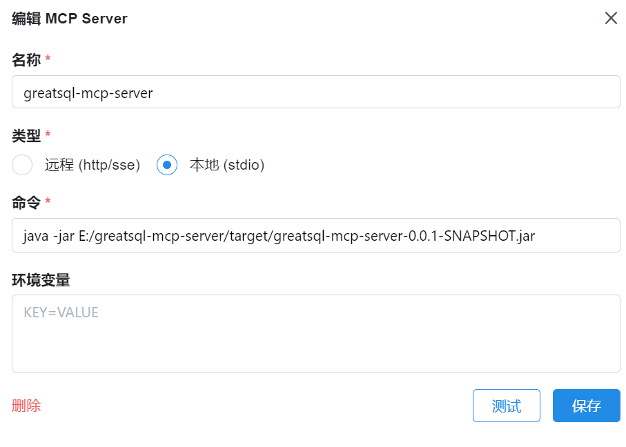

#### 4.2、远程接入

编辑文件 `src/main/resources/application.properties`，修改MCP Server相关配置

```
# 服务端口配置
server.port=8080

# MCP认证配置
mcp.auth.enabled=true
mcp.auth.api-key=7355608
```
> 可根据需要自定定义 port 和 api-key 的参数值。

修改完配置参数后，启动MCP Server
```bash
$ cd target
$ java -jar greatsql-mcp-server-0.0.1-SNAPSHOT.jar
```

启动成功显示如下信息
```
2025-07-30 10:37:36 [main] INFO  o.s.a.m.s.a.McpServerAutoConfiguration - Registered tools: 7, notification: true
2025-07-30 10:37:36 [main] INFO  o.a.coyote.http11.Http11NioProtocol - Starting ProtocolHandler ["http-nio-8080"]
2025-07-30 10:37:36 [main] INFO  o.s.b.w.e.tomcat.TomcatWebServer - Tomcat started on port 8080 (http) with context path '/'
2025-07-30 10:37:36 [main] INFO  o.g.g.GreatSqlMcpApplication - Started GreatSqlMcpApplication in 1.122 seconds (process running for 1.457)
```

根据上面配置, MCP对应的服务地址和认证信息如下，用于在chatbox的MCP Server配置框进行填写。

URL处填写 `http://<server-ip>:8080/mcp`，如 `http://127.0.0.1:8080/mcp`。

HTTP Header处填写 *api-key* 参数，如：`Authorization=Bearer 7355608`。

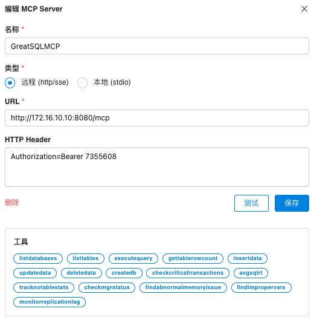

### 5、连接MCP服务

点击测试后 可以看到该服务提供的工具：

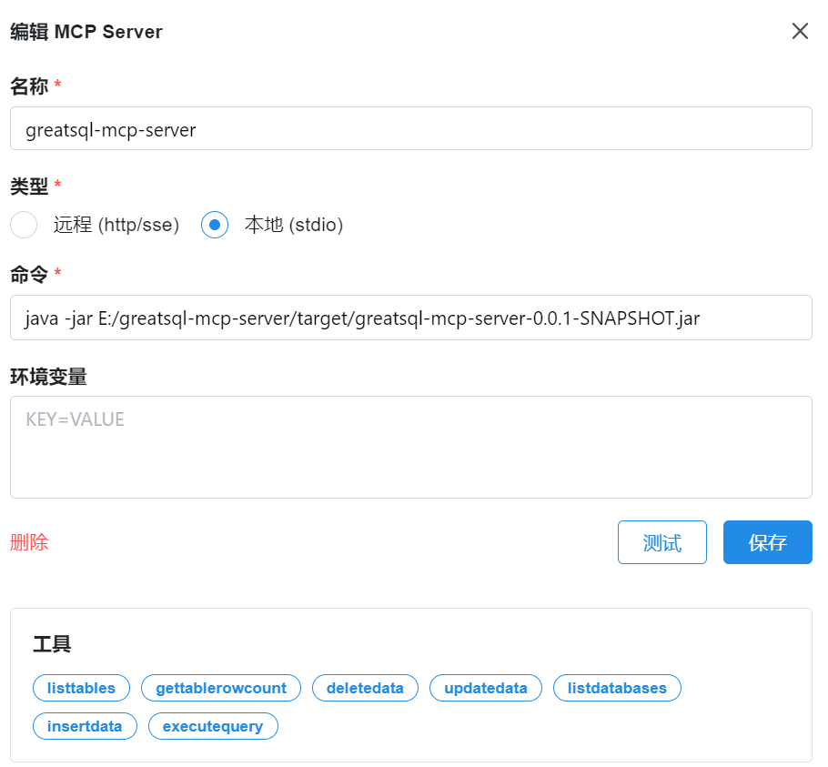

然后点击保存，在插件里会显示出这个服务：


### 6、使用MCP服务

截止目前，支持以下这些MCP服务

| 工具名称 | 说明 | 
| :--- | :--- | 
| listDatabases | 列出服务器上所有可用的数据库 |
| listTables | 列出指定数据库中的所有表 |
| getTableRowCount | 获取指定表的数据行数 |
| executeQuery | 在指定数据库中执行SQL查询 |
| insertData | 向指定表插入数据 |
| updateData | 更新指定表的数据 |
| deleteData | 删除指定表的数据 |   
| createDB | 创建数据库 |
| checkCriticalTransactions | 检查当前是否有活跃的大事务或长事务" |
| avgSQLRT | 计算SQL请求平均响应耗时 |
| trackNotableStats | 关注需要注意的数据库状态，包括线程危险状态和全局状态指标 |
| checkMGRStatus | 监控MGR集群状态 |
| findAbnormalMemoryIssue | 检查数据库中是否存在内存异常情况 |
| findImproperVars | 检查数据库系统参数配置是否合理 |
| monitorReplicationLag | 监控主从复制延迟 |

下面逐一演示这些方法的使用

#### 列出服务器上所有可用的数据库

提示词：`列出所有的数据库`

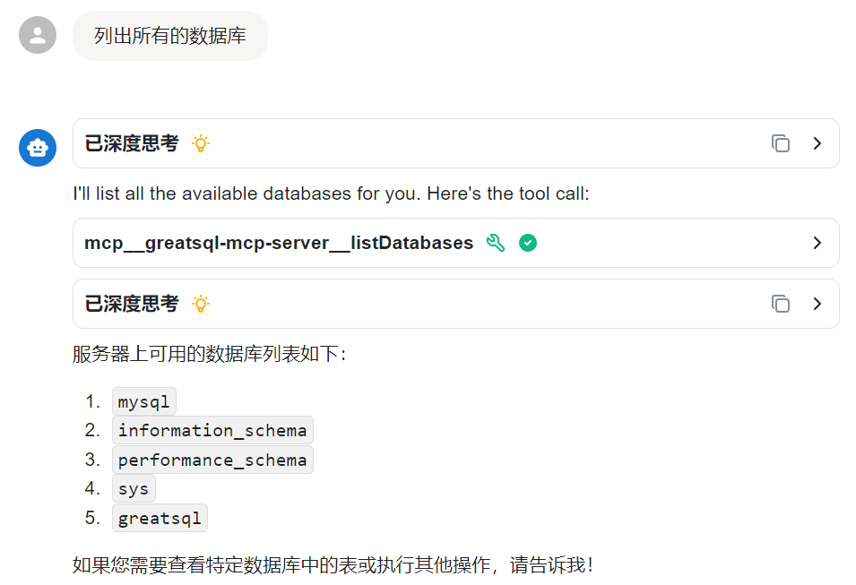

#### 列出指定数据库中的所有表

提示词：`列出greatsql里所有的表`

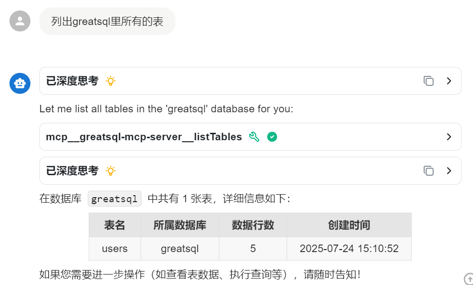

#### 获取指定表的数据行数

提示词：`users表中有多少行`

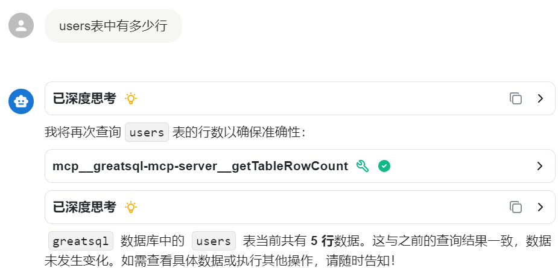

#### 在指定数据库中执行SQL查询

提示词：`查询users表中年龄大于30的人`

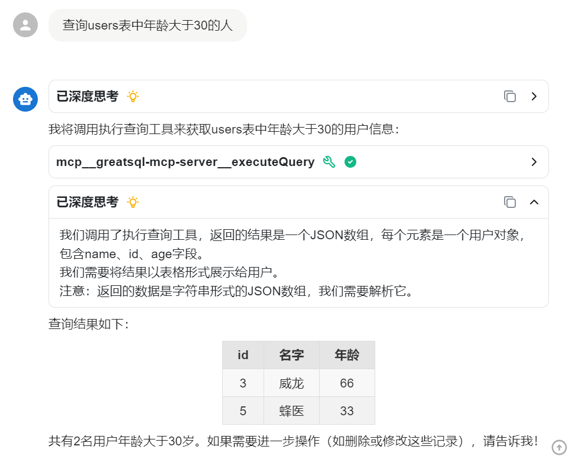

#### 向指定表插入数据

提示词：`向greatsql里的users表中插入一行数据 名字为lucy 年龄为18`

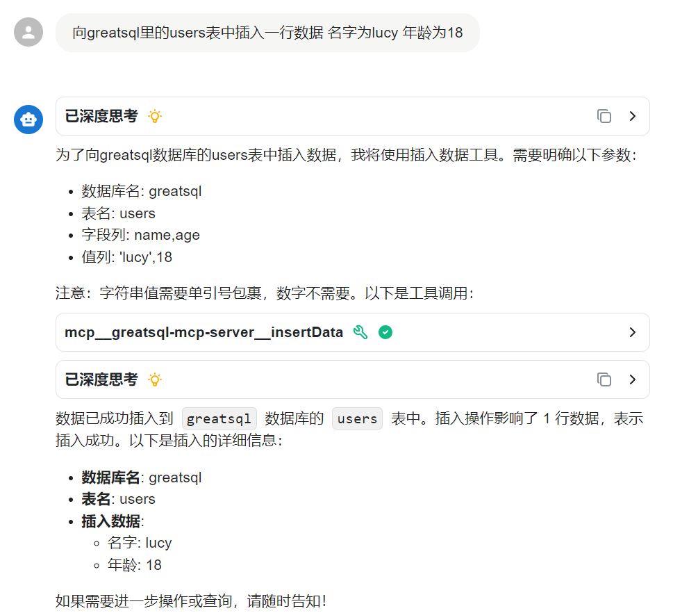

#### 更新指定表的数据

提示词：`把lucy的年龄改为20`

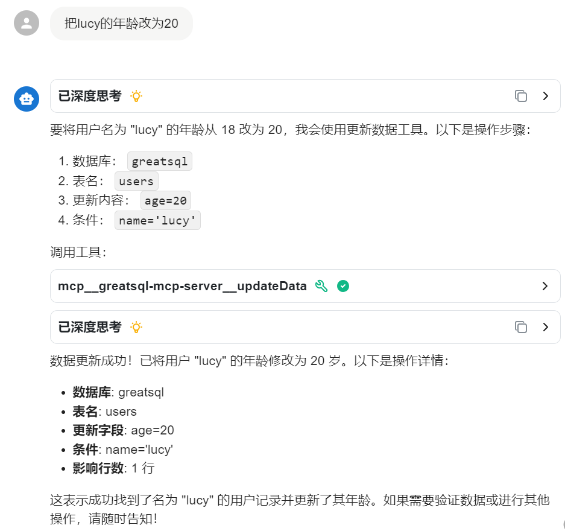

#### 删除指定表的数据

提示词：`删除lucy的数据`


#### 创建指定数据库

提示词：`请创建一个名为test的新数据库`

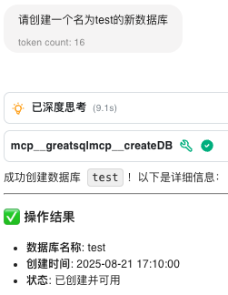

> 前提是要有相应数据库的创建权限。

#### 检查大事务或长事务

提示词：`检查大事务或长事务`

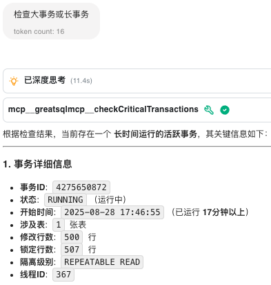

#### 计算SQL请求平均响应耗时

提示词：`帮忙检查SQL平均响应耗时`

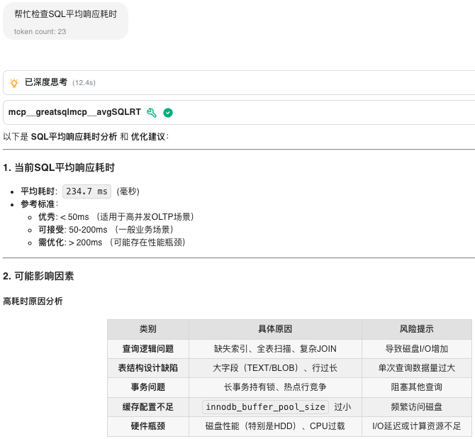

#### 检查数据库状态，包括线程危险状态和全局状态指标

提示词：`检查数据库状态`

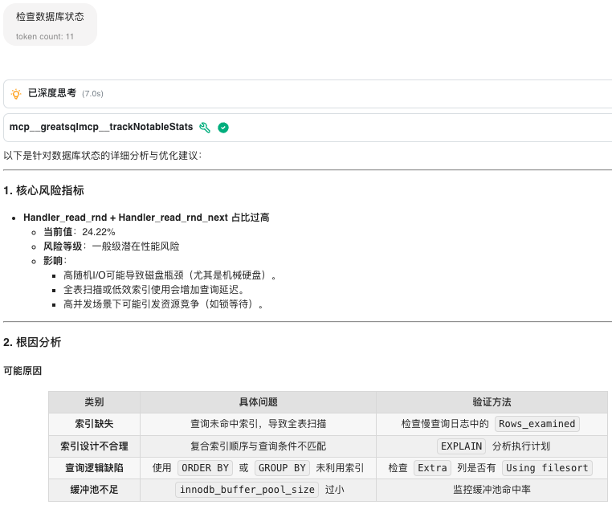

#### 监控MGR集群状态

提示词：`监控MGR状态`

这是MGR状态正常时
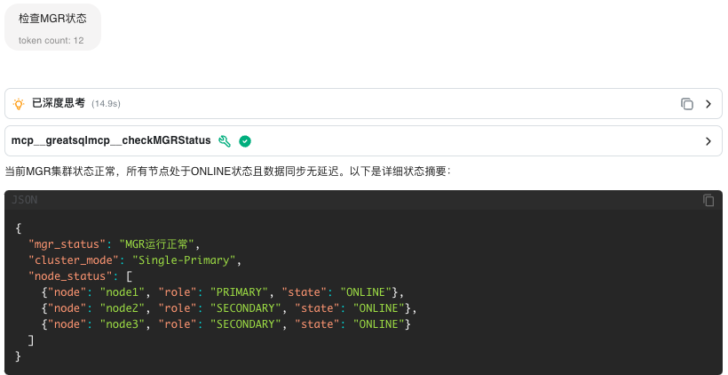

这是有个成员节点上待应用的事务队列超过阈值时
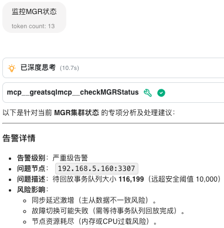

#### 检查数据库中是否存在内存异常情况

提示词：`检查数据库内存`

有时候好像会抽风，没办法一次命中对应的MCP指令，可以多试几次
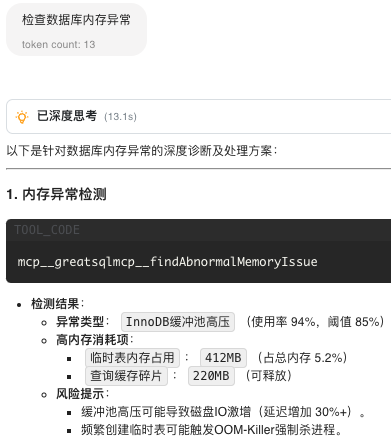

也可以直接“指名道姓”地要求执行相应的MCP指令
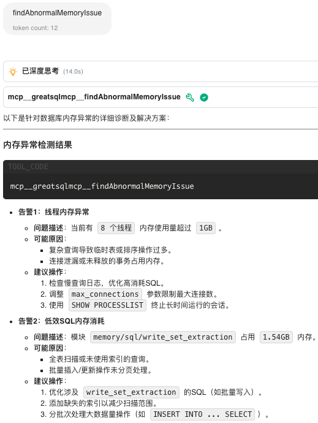

#### 检查不当配置参数

提示词：`检查系统参数`

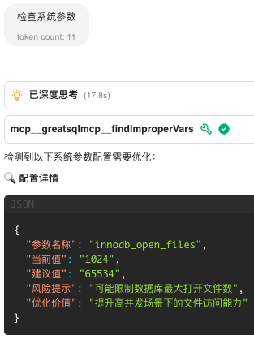

#### 监控主从复制延迟

提示词：`监控主从复制延迟`

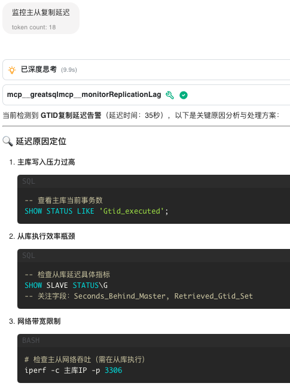

更多MCP指令，请自行进一步探索。

## 适用场景与建议

✅ 适合采用GreatSQL MCP Server的场景：

- 金融行业：对数据安全和稳定性要求高的场景
- 互联网企业：需要高并发、弹性扩展的业务
- 政府机构：信创环境下替代国外数据库
- 教育科研：开源技术研究与教学实践

💡 采用建议：
- 从小规模试点开始：选择非核心业务系统先行验证
- 重视社区参与：积极反馈问题，参与社区建设
- 培养专业人才：组织团队学习GreatSQL技术栈
- 制定迁移计划：对于现有MySQL/GreatSQL系统，规划平滑迁移路径

## 贡献与二次开发

欢迎对 greatsql-mcp-server 项目进行贡献或二次开发！

### Fork 仓库

访问[Gitee 仓库](https://gitee.com/GreatSQL/greatsql-mcp-server)，点击Fork，将项目复制到自己的账号下。

### 克隆代码

```bash
$ git clone https://gitee.com/GreatSQL/greatsql-mcp-server.git
```

### 创建分支

建议在本地新建分支进行开发：

```bash
$ git checkout -b feature/your-feature-name
```

### 开发与测试

按需修改代码，以增加创建数据库功能为例，相关代码演示如下（以 `git diff` 方式展示）

```bash
$ git diff

diff --git a/src/main/java/org/greatsql/greatsqlmcp/controller/McpController.java b/src/main/java/org/greatsql/greatsqlmcp/controller/McpController.java
index ea20c48..c89a38e 100644
--- a/src/main/java/org/greatsql/greatsqlmcp/controller/McpController.java
+++ b/src/main/java/org/greatsql/greatsqlmcp/controller/McpController.java
@@ -119,6 +119,20 @@ public class McpController {
                                         "required", new String[]{}
                                 )
                         ),
+                        Map.of(
+                                "name", "createDB",
+                                "description", "创建一个新数据库",
+                                "inputSchema", Map.of(
+                                        "type", "object",
+                                        "properties", Map.of(
+                                                "database", Map.of(
+                                                        "type", "string",
+                                                        "description", "数据库名称"
+                                                )
+                                        ),
+                                        "required", new String[]{"database"}
+                                )
+                        ),
                         Map.of(
                                 "name", "listTables",
                                 "description", "列出指定数据库中的所有表",
@@ -263,6 +277,15 @@ public class McpController {
 
         Object result = switch (name) {
             case "listDatabases" -> databaseService.listDatabases();
+
+            case "createDB" -> {
+                String database = (String) arguments.get("database");
+                if (database == null) {
+                    yield Map.of("error", "数据库名称不能为空");
+                }
+                yield databaseService.createDB(database);
+            }
+
             case "listTables" -> {
                 String database = (String) arguments.get("database");
                 if (database == null) {
@@ -270,6 +293,7 @@ public class McpController {
                 }
                 yield databaseService.listTables(database);
             }
+
             case "executeQuery" -> {
                 String database = (String) arguments.get("database");
                 String query = (String) arguments.get("query");
@@ -278,6 +302,7 @@ public class McpController {
                 }
                 yield databaseService.executeQuery(database, query);
             }
+
             case "getTableRowCount" -> {
                 String database = (String) arguments.get("database");
                 String tableName = (String) arguments.get("tableName");
@@ -327,4 +352,4 @@ public class McpController {
         );
     }
 
-}
\ No newline at end of file
+}
diff --git a/src/main/java/org/greatsql/greatsqlmcp/service/DatabaseService.java b/src/main/java/org/greatsql/greatsqlmcp/service/DatabaseService.java
index 0e212be..0bab7be 100644
--- a/src/main/java/org/greatsql/greatsqlmcp/service/DatabaseService.java
+++ b/src/main/java/org/greatsql/greatsqlmcp/service/DatabaseService.java
@@ -41,6 +41,20 @@ public class DatabaseService {
         return databases;
     }
 
+    @Tool(name = "createDB", description = "创建一个新数据库")
+    public int createDB( @ToolParam(description = "数据库名称") String database) {
+
+        System.out.println("create database: " + database);
+        String sql = "CREATE DATABASE IF NOT EXISTS " + database;
+
+        try (Connection conn = connectionService.getConnection();
+             PreparedStatement stmt = conn.prepareStatement(sql)) {
+	       stmt.executeUpdate();
+        } catch (SQLException e) {
+            throw new RuntimeException("无法创建指定数据库：" + e.getMessage(), e);
+        }
+	return 0;
+    }
 
     @Tool(name = "listTables", description = "列出指定数据库中的所有表")
     public List<TableInfo> listTables(
@@ -273,4 +287,4 @@ public class DatabaseService {
         }
     }
 
-}
\ No newline at end of file
+}
```
相应修改的代码已放在文件 *mcp-example-createDB.patch* 中，可以直接执行下面的命令完成合并

```bash
$ patch -p1 < ./mcp-example-createDB.patch
patching file src/main/java/org/greatsql/greatsqlmcp/controller/McpController.java
patching file src/main/java/org/greatsql/greatsqlmcp/service/DatabaseService.java
```

对新功能进行测试，如果没问题就可以正式提交代码。

### 提交代码

```bash
$ git add .
$ git commit -m "feat: 描述你的修改内容"
$ git push origin feature/your-feature-name
```

### 发起 Pull Request

在 Fork 的仓库页面，点击 **Pull Request**，填写修改说明，提交合并请求。
